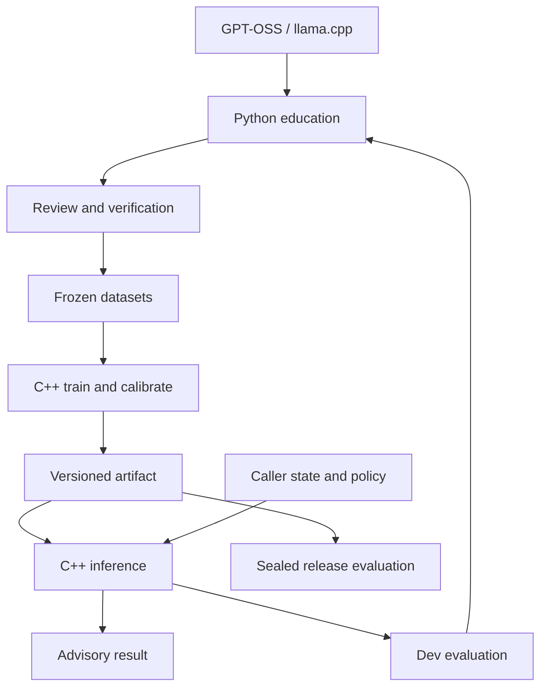

# Architecture — design v1

Status: proposed; [review and current implementation inventory](design-review.md). Scope and acceptance: [requirements](requirements.md).

## Ownership

| Component | Owns | Must not own |
|---|---|---|
| C++ core | tokenizer assembly, explicit model, losses, training, calibration, inference, primitive metrics, artifact checks | teacher calls, execution authority, MCP, Python runtime |
| Python education | curriculum, HTTP teacher/reviewer, deterministic scenario oracle, review audit, splitting/freezing, orchestration, analysis/reports | second neural implementation, changing frozen weights or benchmarks |
| llama.cpp + GPT-OSS | replaceable teacher inference endpoint | Arbitrium runtime dependency or label authority |
| Host / Intelligence adapter | artifact allowlist, deadlines, concurrency, authentication, caller policy and action | silently interpreting abstention as an action |
| External artifact storage | immutable datasets/checkpoints/bundles and retained audit records | hidden authoritative model state |

Only dev evaluation feeds the school. Sealed test results have the restrictions in [evaluation](evaluation.md); there is no arrow back to teacher generation.

## C++ modules and dependency direction

`contracts` contains typed values/errors; `data` validates frozen manifests and reads JSONL; `tokenizer` owns SentencePiece wrapper and assembly; `model` consumes tensors only; `training` depends on those modules and LibTorch autograd; `calibration` fits/validates postprocessing; `artifact` verifies bundles; `inference` composes validation→tokenizer→forward→calibration→gates; `evaluation` computes per-record predictions and primitive metrics; `app` owns CLI and I/O. Domain modules do not call CLI or transport modules.

Expected implementation locations remain `include/arbitrium/`, `src/{model,data,tokenizer,training,calibration,inference,evaluation,artifact,app}/`, and `tests/`. Do not move the existing C++ tree into a new `cpp/` directory without a separate need.

## Python modules

Keep `education/python/`. Evolve existing teacher/provider/orchestrator modules into separate contract validation, generation, blind review, verifier, audit store, freeze, curriculum, transport, benchmark and analysis responsibilities. Use explicit functions/classes and local files; no database or service framework is required. All orchestration reads and writes versioned artifacts with hashes. Direct LibTorch/PyTorch model execution in Python is forbidden.

## Boundary data

| Boundary | Format / authority |
|---|---|
| Teacher → school | strict JSON candidate; untrusted proposal |
| School → learner | reviewed immutable JSONL + manifest; training reads train/dev only |
| Learner → inference | v1 bundle with C++ native weights, tokenizer, task, config, calibration and hashes |
| Python → C++ | CLI argv + files / JSONL pipes |
| Core → caller | typed DecisionResult; no action |

Task specifications and assembly version are embedded and hashed with artifacts. There is no mutable task registry downloaded at inference. Adding a task requires its own dataset and artifact. Within an artifact class positions are fixed; request label order is merely a serialization preference.

## State and authority

Weights do not change during inference. Request tensors are transient. Checkpoints retain training state only. Audit logs and education journals are external educational state. Oblivionis may supply a bounded snapshot through a separately reviewed adapter; neither its memory nor lifecycle belongs here.

## Research sequencing

Rule/majority comparator → pooled baseline → tiny encoder → calibrated candidate → sealed evaluation → advisory integration. Interfaces are designed for binary/ordinal extensions, but they do not delay the first choice experiment. Multi-task models, dynamic candidates and custom kernels remain separate research proposals.
